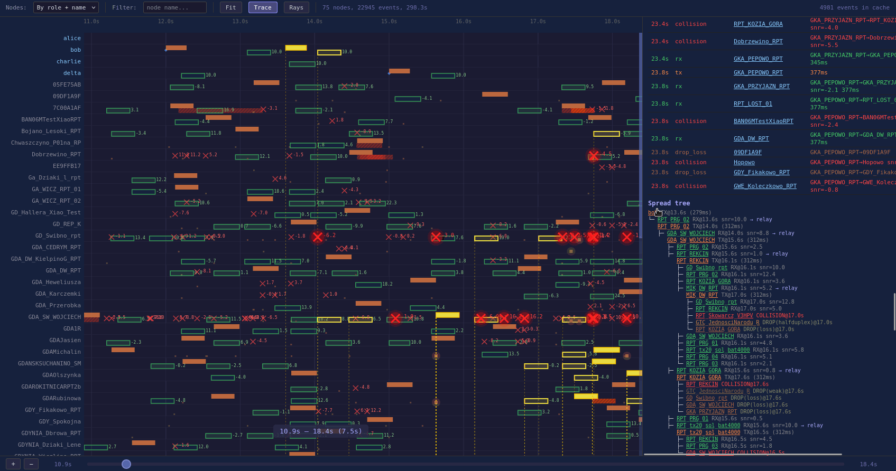
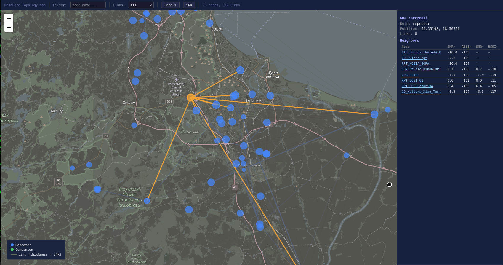

# MeshCore Real Sim

A single-process network simulator for [MeshCore](https://github.com/ripplebiz/MeshCore) LoRa mesh networks. Runs unmodified MeshCore firmware code against a configurable virtual radio layer with realistic RF propagation, collisions, and half-duplex constraints.





## Building

Requires CMake 3.16+, a C++17 compiler, OpenSSL development libraries, and Python 3.10+.

```bash
# Install system dependencies (Debian/Ubuntu)
sudo apt install build-essential cmake libssl-dev python3 python3-venv

# Clone the repo
git clone --recursive https://github.com/stachuman/meshcore_simv2.git
cd meshcore_simv2

# Set up Python virtual environment
python3 -m venv venv
source venv/bin/activate
pip install -r requirements.txt

# Build
cmake -S . -B build
cmake --build build
```

If you already cloned without `--recursive`, initialize the MeshCore submodule:

```bash
git submodule update --init
```

The Python venv must be active when running visualization or topology tools (`source venv/bin/activate`).

This produces three binaries:
- `build/orchestrator/orchestrator` -- the multi-node simulator (main tool)
- `build/simple_repeater/simple_repeater` -- standalone single-repeater binary
- `build/companion_radio/companion_radio` -- standalone single-companion binary

## Quick Start

### Run a test config

```bash
build/orchestrator/orchestrator test/t02_hot_start_msg.json
```

NDJSON event log goes to stdout, summary and assertions to stderr.

### Run with visualization

```bash
tools/run_sim.sh test/t06_msg_stats.json
```

This runs the orchestrator, saves events as `t06_msg_stats_events.ndjson`, and opens an interactive swim-lane visualizer in the browser (plus a topology map view if the config has coordinates).

### Run all tests

```bash
bash test/run_tests.sh
```

Discovers all `test/t*.json` files and reports pass/fail.

## Simulation Config

Configs are JSON files with these sections:

```json
{
  "simulation": {
    "duration_ms": 90000,
    "step_ms": 4,
    "warmup_ms": 5000,
    "hot_start": true
  },
  "nodes": [
    { "name": "alice", "role": "companion" },
    { "name": "relay1", "role": "repeater" },
    { "name": "bob", "role": "companion" }
  ],
  "topology": {
    "links": [
      { "from": "alice", "to": "relay1", "snr": 8.0, "rssi": -80.0, "bidir": true },
      { "from": "relay1", "to": "bob", "snr": 8.0, "rssi": -80.0, "bidir": true }
    ]
  },
  "commands": [
    { "at_ms": 6000, "node": "alice", "command": "msg bob hello" }
  ],
  "expect": [
    { "type": "cmd_reply_contains", "node": "alice", "command": "msg bob", "value": "msg sent to bob" }
  ]
}
```

- **`hot_start`** -- injects mutual node awareness at t=0 (skips the slow advert exchange)
- **`warmup_ms`** -- instant packet delivery during warmup (no collisions/physics)
- **`message_schedule`** -- auto-generates periodic `msg`/`msga` commands (supports `"ack": true`)

See [docs/CONFIG_FORMAT.md](docs/CONFIG_FORMAT.md) for full reference.

## Working with Real Topologies

Generate simulation configs from real-world node data using the **topology generator** -- a two-stage pipeline:

1. **`topology_generator`** -- fetches live node positions from the MeshCore network API, computes RF links using the ITM propagation model, and outputs a topology config
2. **`inject_test.py`** -- places companion nodes, generates message schedules, and produces a ready-to-run simulation config

### Quick start: Gdansk region test

The included `prepare_gdansk_test.sh` runs the full pipeline:

```bash
bash prepare_gdansk_test.sh
build/orchestrator/orchestrator simulation/gdansk_test.json
```

This fetches ~100 repeaters from the Gdansk/Pomerania region, computes ITM-based RF links, places 4 companions on well-connected repeaters, and generates a 15-minute test with direct messages and channel broadcasts.

### Running the pipeline manually

```bash
# Step 1: Generate topology from live network data
python3 -m topology_generator \
    --region 53.7,17.3,54.8,19.5 \
    --freq-mhz 869.618 --tx-power-dbm 20.0 --antenna-height 5.0 \
    --sf 8 --bw 62500 --cr 4 \
    --max-distance-km 40 --min-snr -10.0 \
    --max-edges-per-node 12 --link-survival 0.4 \
    --clutter-db 6.0 \
    -v -o simulation/gdansk_topology.json

# Step 2: Inject companions and message schedules
python3 tools/inject_test.py simulation/gdansk_topology.json \
    --companions 4 --companion-names alice,bob,carol,dave \
    --min-neighbors 2 \
    --auto-schedule --channel \
    --msg-interval 70 --msg-count 5 \
    --chan-interval 80 --chan-count 4 \
    --duration 900000 \
    -v -o simulation/gdansk_test.json

# Step 3: Run and visualize
tools/run_sim.sh simulation/gdansk_test.json -v
```

Key topology generator flags:

| Flag | Default | Description |
|---|---|---|
| `--region` | (required) | Bounding box: `lat_min,lon_min,lat_max,lon_max` |
| `--freq-mhz` | 869.618 | LoRa carrier frequency |
| `--max-distance-km` | 40 | Skip node pairs beyond this range |
| `--min-snr` | -10.0 | Drop links below this SNR |
| `--link-survival` | 1.0 | Stochastic link survival probability (0.4 = realistic sparsity) |
| `--clutter-db` | 6.0 | Additional attenuation for urban/suburban clutter |
| `--max-edges-per-node` | 12 | Safety cap on neighbor count |
| `--api-cache` | none | Cache API responses to avoid repeated downloads |

See [docs/TOPOLOGY_GENERATOR.md](docs/TOPOLOGY_GENERATOR.md) for full documentation.

## Testing Different MeshCore Variants

By default the simulator builds against the `MeshCore/` git submodule. To test a fork or feature branch, clone it and point `MESHCORE_DIR` to it. Use a separate build directory so both builds coexist.

```bash
# 1. Clone your MeshCore fork alongside this repo
git clone https://github.com/YOUR_USER/MeshCore.git ../MeshCore-fork

# 2. Build the simulator against the fork (separate build dir)
cmake -S . -B build-fork -DMESHCORE_DIR=$(pwd)/../MeshCore-fork
cmake --build build-fork

# 3. Run the same test against both builds to compare behavior
build/orchestrator/orchestrator test/t06_msg_stats.json 2>/tmp/stock.txt
build-fork/orchestrator/orchestrator test/t06_msg_stats.json 2>/tmp/fork.txt
diff /tmp/stock.txt /tmp/fork.txt
```

To switch your fork to a different branch and rebuild:

```bash
cd ../MeshCore-fork
git checkout my-feature-branch
cd ../meshcore_simv2
cmake --build build-fork
```

No need to re-run `cmake -S ...` -- the `MESHCORE_DIR` path is cached. Just rebuild after changing the MeshCore sources.

## Radio Physics Model

The simulator models realistic LoRa radio behavior:

- **LoRa airtime** -- exact symbol/preamble/payload timing for any SF/BW/CR combination
- **Half-duplex** -- nodes cannot transmit while receiving (and vice versa)
- **Collisions** -- 3-stage survival: capture effect (6dB), preamble grace window, FEC tolerance
- **Listen-before-talk** -- preamble detection delay, SNR-gated channel busy notifications
- **SNR variance** -- per-link Gaussian sampling (`snr_std_dev`)
- **Stochastic loss** -- per-link drop probability (`loss`)
- **Adversarial modes** -- per-node packet drop, bit corruption, or delayed replay

## Visualization

The visualizer serves two interactive views:

```bash
python3 visualization/visualize.py events.ndjson --config config.json
```

- **Swim-lane view** (port 8000) -- timeline of TX/RX/collision events per node, with packet tracing
- **Map view** (port 8001) -- geographic topology with link SNR coloring (requires `--config` with node coordinates)

Controls: scroll to zoom, drag to pan, click packets for details, press `T` for spread-tree trace.

## Test Generator

Generate grid topology tests with configurable dimensions:

```bash
python3 tools/gen_grid_test.py --rows 5 --cols 5 -n 4 -o test/t_custom_grid.json
```

Creates a repeater grid with companion nodes at the corners, auto-generates cross-grid messaging commands and discovery assertions.

## Project Structure

```
MeshCore/            MeshCore firmware sources (read-only, never modified)
shims/               Platform shim layer (Arduino, FS, crypto, radio)
orchestrator/        Multi-node simulator engine
  Orchestrator.cpp   Main simulation loop, physics, collision detection
  JsonConfig.cpp     Config parser
  CompanionNode.cpp  Companion mesh node factory
  RepeaterNode.cpp   Repeater mesh node factory
simple_repeater/     Standalone single-repeater binary
companion_radio/     Standalone single-companion binary
topology_generator/  ITM-based topology generation from live network data
simulation/          Real-world topology data and generated configs
test/                Test configs (t*.json) and runner
tools/               Injection, generation, analysis, and run scripts
visualization/       Interactive event visualizer
docs/                Config format and model documentation
```
